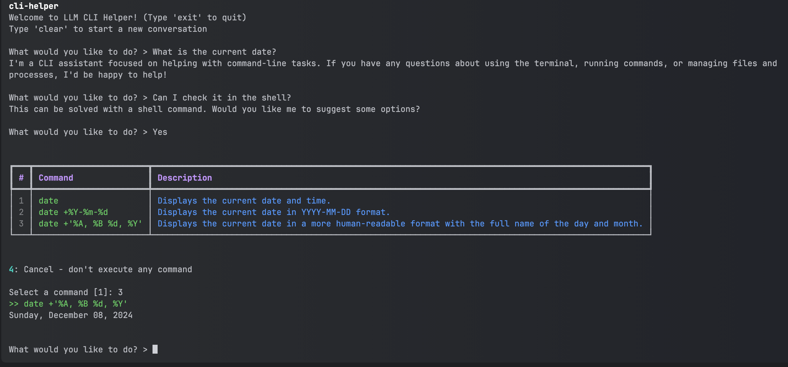

# CLI Helper

An intelligent command-line interface helper powered by GPT-4o that suggests and executes shell commands based on natural language descriptions.

## Features

- Natural language to shell command conversion
- Multiple command suggestions with descriptions
- Interactive command selection
- Automatic shell detection
- Conversation history management
- Support for bash, zsh, and fish shells



## Installation

1. Clone the repository:
```bash
git clone https://github.com/yourusername/cli-helper.git
cd cli-helper
```
2. Install the package:
```bash
pip install -e .
```
## Configuration

Before using the tool, set your OpenAI API key:
```bash
export OPENAI_API_KEY='your-api-key-here'
```

For permanent configuration, add the above line to your shell's configuration file (`~/.bashrc`, `~/.zshrc`, etc.).

## Usage

Once installed, you can run the tool from anywhere using:
```bash
cli-helper [--model MODEL] [--max-tokens MAX_TOKENS] [-q QUESTION]
```
### Options:
- `--model`: OpenAI model to use (default: gpt-4o)
- `--max-tokens`: Maximum tokens for response (default: 1000)
- `-q, --question`: Initial question to start with

### Commands:
- Type your request in natural language
- Use 'clear' to start a new conversation
- Use 'exit' or 'quit' to close the program

### Example Usage:
```bash
What would you like to do? > Find all PDF files in the current directory
```
The tool will suggest various commands and let you choose which one to execute.

## Development

To set up the development environment:

1. Clone the repository
2. Create a virtual environment:
   ```bash
   python -m venv venv
   source venv/bin/activate
   ```
3. Install development dependencies:
   ```bash
   pip install -e .
   ```

## License

MIT License

## Contributing

Contributions are welcome! Please feel free to submit a Pull Request.
